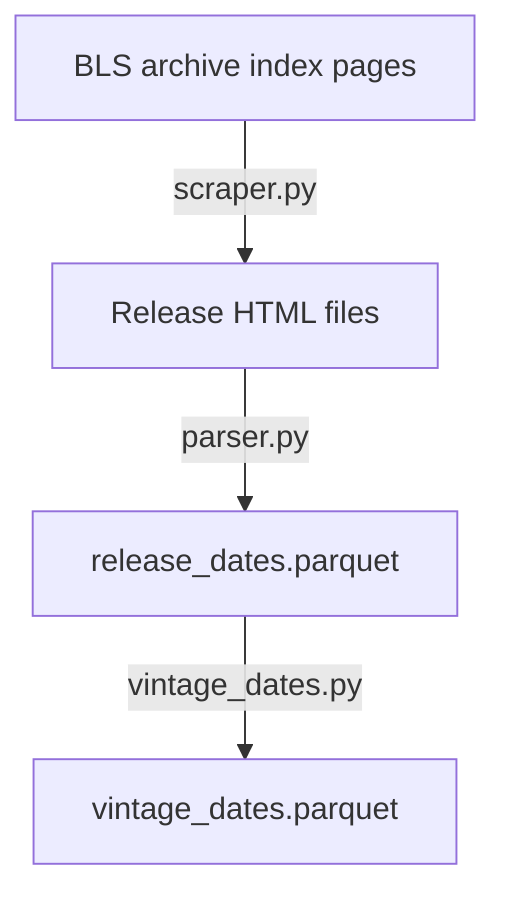
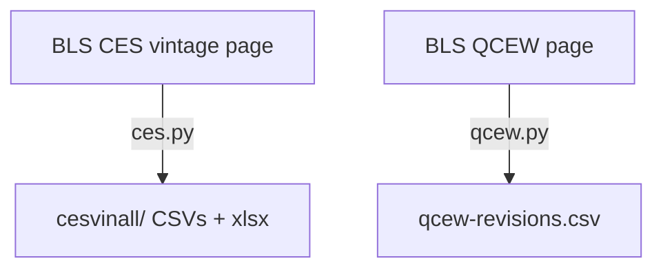
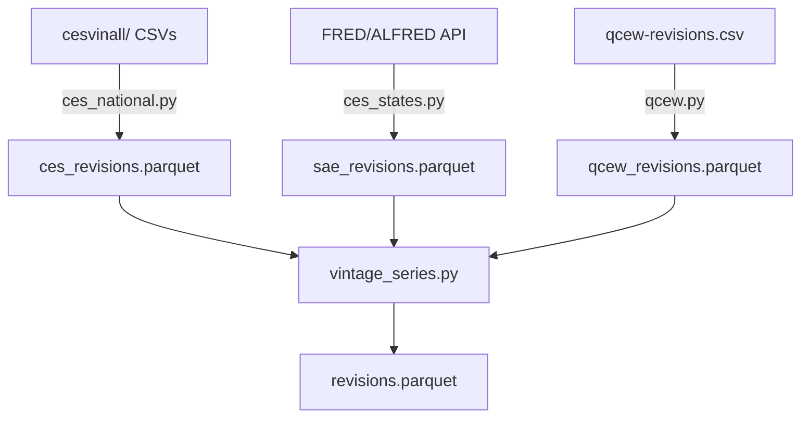

# Architecture

## Package structure

```
src/bls_revisions/
├── __init__.py               # Public API re-exports
├── __main__.py               # CLI dispatcher
├── _client.py                # Shared HTTP client with retry
├── release_dates/            # Stage 1: release date scraping
│   ├── config.py             # Publication definitions & paths
│   ├── scraper.py            # Async index fetching & downloading
│   ├── parser.py             # HTML embargo-date extraction
│   ├── read.py               # Parquet readers
│   ├── vintage_dates.py      # Revision code assignment
│   └── __main__.py           # Release-dates CLI
├── download/                 # Stage 2: raw data downloaders
│   ├── ces.py                # CES vintage spreadsheets
│   └── qcew.py               # QCEW revisions CSV
└── processing/               # Stage 3: data processing
    ├── __init__.py            # Shared constants (DATA_DIR, STATES)
    ├── ces_national.py        # CES triangular matrices
    ├── ces_states.py          # SAE via FRED/ALFRED
    ├── qcew.py                # QCEW reshape & join
    └── vintage_series.py      # Combine & aggregate
```

## Pipeline stages

The system is designed as a three-stage pipeline.  Each stage can be run independently (as long as its inputs exist), making it easy to iterate on a single step without re-running the whole pipeline.

### Stage 1: Release date scraping (`release_dates/`)



The scraper is **async** (using `httpx.AsyncClient`) with configurable concurrency to be polite to BLS servers.  Downloads are idempotent — existing HTML files are skipped.

The parser uses a regex to extract the embargo date from each HTML file.  The vintage_dates module then expands the simple release-date list into a full revision schedule using publication-specific rules.

### Stage 2: Data downloading (`download/`)



Both downloaders use the shared `_client` module for HTTP/2 requests with retry logic.

### Stage 3: Processing (`processing/`)



Each processing module reads its raw input, joins vintage dates from `vintage_dates.parquet`, and writes a source-specific Parquet file.  The `vintage_series` module then combines all three and adds region/division aggregations.

## Shared components

### HTTP client (`_client.py`)

All HTTP requests go through a shared client that provides:

- **HTTP/2** for multiplexed connections
- **Browser-like headers** to avoid being blocked
- **Exponential back-off** on 429 (rate limit) and 5xx (server error) responses
- **BLS API key injection** when `BLS_API_KEY` is set

### Data directory layout

```
data/
├── releases/               # Stage 1 output: raw HTML files
│   ├── ces/
│   ├── sae/
│   └── qcew/
├── release_dates.parquet   # Stage 1 output: parsed dates
├── vintage_dates.parquet   # Stage 1 output: revision schedule
├── ces/                    # Stage 2 output: CES raw data
│   └── cesvinall/
├── qcew/                   # Stage 2 output: QCEW raw data
├── reference/              # Static lookup tables
├── ces_revisions.parquet   # Stage 3 output
├── sae_revisions.parquet   # Stage 3 output
├── qcew_revisions.parquet  # Stage 3 output
└── revisions.parquet       # Stage 3 output: combined
```
