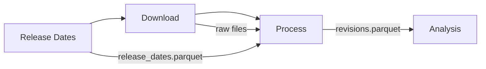

# bls-revisions

**BLS revisions** is a Python toolkit for tracking how Bureau of Labor Statistics employment data gets revised after its initial release.

It covers three BLS surveys:

| Survey | Full name | Geography | Frequency |
|--------|-----------|-----------|-----------|
| **CES** | Current Employment Statistics | National | Monthly |
| **SAE** | State and Area Employment | State | Monthly |
| **QCEW** | Quarterly Census of Employment and Wages | National + State | Quarterly |

## What does it do?

Every month the BLS publishes preliminary employment numbers, then quietly revises them in subsequent releases.  This package builds a complete history of those revisions so you can study their size, direction, and patterns.

The pipeline has three stages:



1. **Release date scraping** — download BLS news-release archive pages and extract the embargo (vintage) dates that tell us *when* each data point was first published.
2. **Data downloading** — fetch the CES triangular-revision spreadsheets and the QCEW revisions CSV from bls.gov.
3. **Processing** — read the raw files, attach vintage dates, and produce tidy Parquet datasets suitable for revision analysis.

## Quick start

```bash
pip install -e ".[docs]"

# Run the full pipeline
bls-revisions

# Or run individual stages
bls-revisions release
bls-revisions download
bls-revisions process
```

See [Getting Started](getting-started.md) for detailed setup instructions.

## Python API

```python
from bls_revisions import (
    download_ces,
    download_qcew,
    read_release_dates,
    read_vintage_dates,
    build_vintage_dates,
)
```

See the [API Reference](api/index.md) for full documentation.
